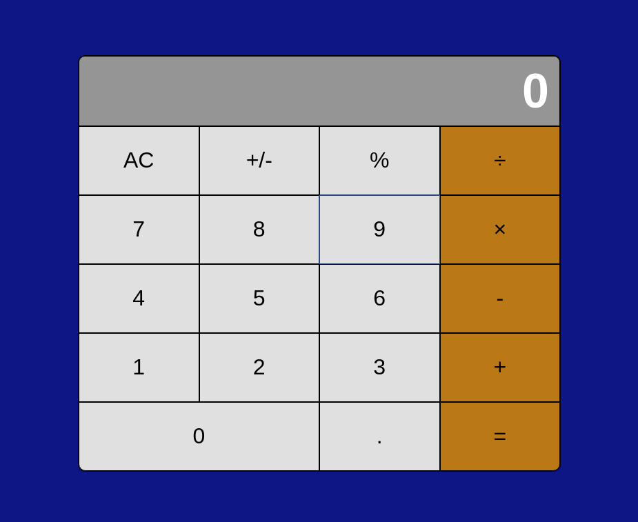

### React Calculator

## Table of Contents

* [About the Project](#about-the-project)
  * [Built With](#built-with)
* [Setup](#setup)
* [Author](#author)
* [Show your Support](#show-your-support)
* [Acknowledgements](#acknowledgements)

<!-- ABOUT THE PROJECT -->
## About The Project



In this project, I created a calculator using React for a fictional company named "Math-magicians"

Live version of the project: [Live version](https://react-calculator-ermin.netlify.app/)

Project Link: [React-Calculator](https://github.com/ermin-cahtarevic/react-calculator)


### Built With

*   React
*   npm
*   CSS
*   ES6

## Setup

```
git clone git@github.com:ermin-cahtarevic/react-calculator.git
```

### Start Development Server

```
npm start
```
### Visit this link in your browser
```
http://localhost:3000/
```

### Run eslint

```
npx eslint .
```

<!-- CONTACT -->
## Author

- Github: [@ermin-cahtarevic](https://github.com/ermin-cahtarevic)
- Twitter: [@ErminCahtarevic](https://twitter.com/ErminCahtarevic)
- Linkedin: [Ermin Cahtarevic](https://www.linkedin.com/in/ermincahtarevic/)

<!-- ABOUT THE PROJECT-->
## Show your support

Give a star if you like this project!

<!-- ACKNOWLEDGEMENTS -->
## Acknowledgements

* [Microverse](https://www.microverse.org/)
